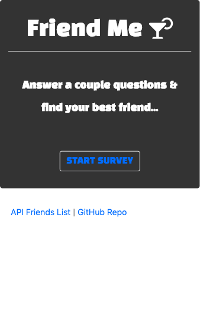
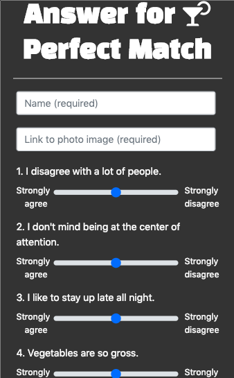
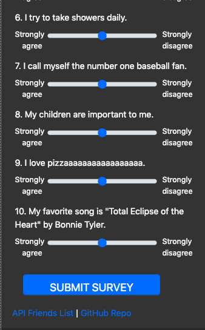
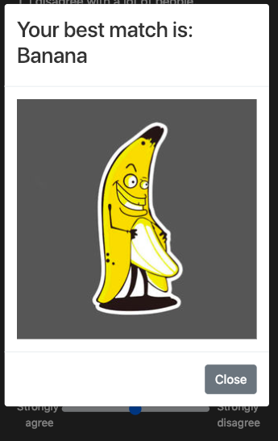

# FriendMe
**Name:** Friend Finder \
**Created for:** Northwestern Coding Bootcamp \
**Developer:** Natalia Kukula \
**Deployment Date:**  December 6, 2018 \
**Runtime:** Node.js\
**Built with:** HTML5, Javascript \
**NPM:** Express, Path \
**Deployed on Heroku:** https://pure-eyrie-99324.herokuapp.com/

## Summary
Mobile-responsive full stack dating site that allows the user to get a best match through submitting a survey.

&nbsp;

### Page 1
 - Home page with a link to the survey, a link to gitHub and a link to the available matches Friends API.
### Page 2
 - Survey page whith Bootstrap range sliders and a modal "best match" pop up.

&nbsp;

## Screen Shots

